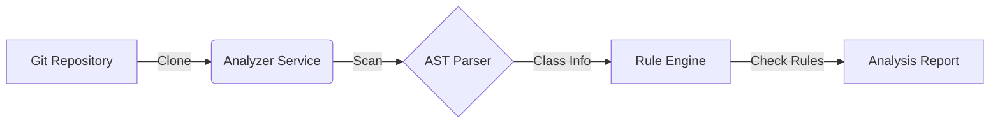

# BackendAnalyzer: Automated Code Review for Spring Boot

## 1. Introduction

### The Problem
- **Manual Code Reviews**: Time-consuming, inconsistent, and prone to human error.
- **Architectural Drift**: Developers bypass layers (e.g., Controller -> Repository) for "quick fixes."
- **Technical Debt**: Unchecked violations accumulate, making the codebase harder to maintain.

### The Solution: BackendAnalyzer
- A **Static Analysis Tool** tailored for Spring Boot.
- **Automated Verification**: Enforces architectural rules and coding standards automatically.
- **Early Detection**: Catches issues before they reach production.

---

## 2. Key Features

- **Automated Workflow**: Clones a Git repository and scans it without manual intervention.
- **Deep Analysis**: Uses **Abstract Syntax Tree (AST)** parsing (via JavaParser) to understand code semantics, not just text patterns.
- **Specific Ruleset**: Comes with built-in rules for common Spring Boot anti-patterns.
- **Extensible Design**: Modular architecture allows adding new rules easily.

---

## 3. Architecture Overview

1.  **Repo Cloner**: Fetches the latest code from the provided Git URL using JGit.
2.  **Scanners**:
    -   `JavaFileScanner`: Locates all `.java` files.
    -   `AnnotationScanner`: Identifies Spring components (`@RestController`, `@Service`, `@Repository`).
    -   `MethodCallScanner`: Maps interaction between components.
3.  **Rule Engine**: Validates the scanned metadata against predefined rules.
4.  **Reporting**: Outputs a list of violations with severity and file location.

---

## 4. Implemented Rules (The "Big 5")

| Rule Name | Description | Severity |
| :--- | :--- | :--- |
| **ControllerRepositoryRule** | Detecting **Controller -> Repository** direct calls. | HIGH |
| **MissingServiceLayerRule** | Ensuring a **Service Layer** exists for business logic. | HIGH |
| **EntityReturnedRule** | Preventing **Database Entities** from being returned by Controllers. | MEDIUM |
| **UnpaginatedFindAllRule** | Detecting usage of `findAll()` without pagination. | MEDIUM |
| **MissingAdviceRule** | Verifying global exception handling (**@RestControllerAdvice**). | MEDIUM |

---

## 5. Technology Stack

- **Core Language**: Java 17
- **Framework**: Spring Boot 3
- **Parsing Library**: JavaParser (`javaparser-core`)
-   *Why JavaParser?* It allows us to query the code structure (e.g., "Find all methods in class X that return type Y") which Regex cannot reliably do.
- **Git Integration**: JGit (`org.eclipse.jgit`)

---

## 6. Demo & Future Scope

### Demo
running the analyzer on `campusCore` or any standard Spring Boot repo reveals:
-   Controllers bypassing services.
-   Missing pagination in list endpoints.
-   Direct entity exposure in API responses.

### Future Roadmap
-   **CI/CD Pipeline**: Block Pull Requests if "High" severity issues are found.
-   **Custom Rules DSL**: Allow teams to define their own architectural rules in a strict `yaml` or `json` format.
-   **Visual Dashboard**: A web interface to track code quality trends over time.

---

## 7. Conclusion

**BackendAnalyzer** moves code quality from "Subjective Opinion" to "Objective Fact." By automating architectural checks, we ensure:
1.  **Consistency**: Every line of code meets the same standard.
2.  **Scalability**: The codebase remains clean as the team grows.
3.  **Efficiency**: Developers spend less time on styling/structure reviews and more on logic.
